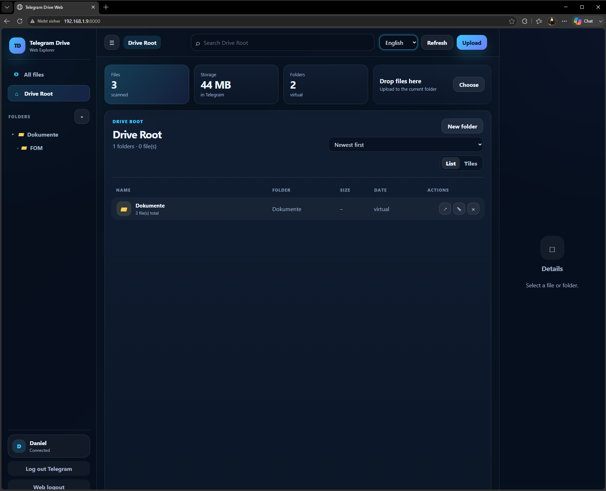
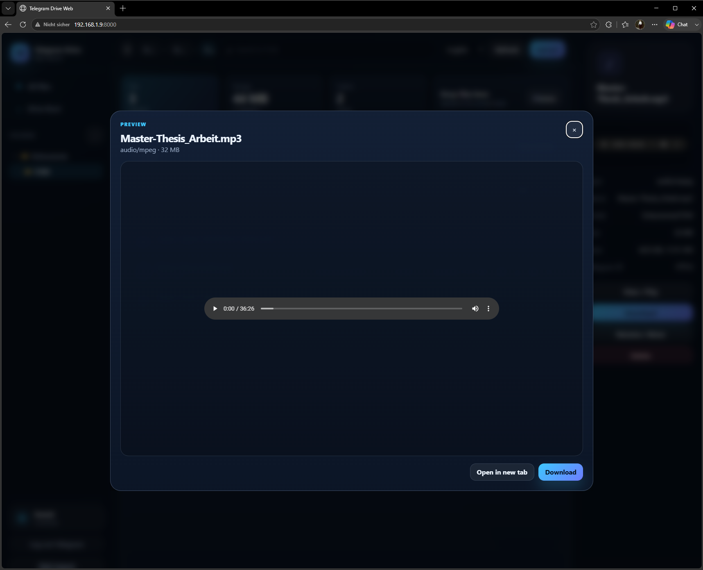
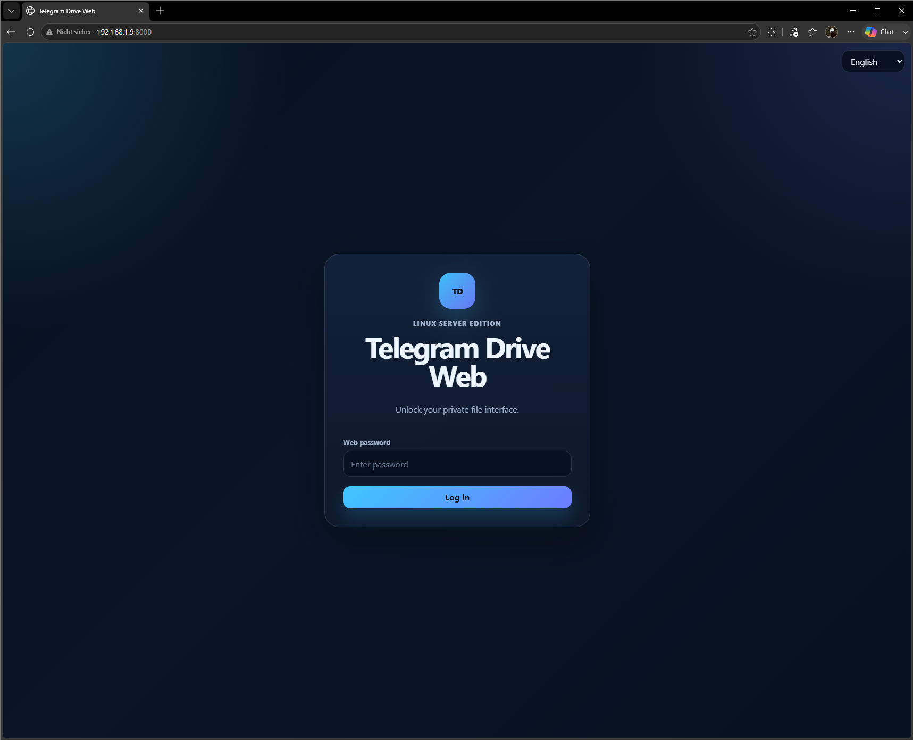

# Telegram Drive Web – Explorer Edition

A self-hosted web file explorer that stores your files in Telegram **Saved Messages** through the Telegram user API.

Telegram Drive Web turns Telegram into a private, browser-based file drive with an Explorer-style interface, virtual folders, search, upload, download, file preview, and mobile support. It is designed to run on a Linux server with Docker Compose.

> **Important:** This project uses your personal Telegram account via Telegram's user API. Treat the application data directory like a password because it contains your Telegram session.

---

## Table of contents

* [What is this?](#what-is-this)
* [Why does this exist?](#why-does-this-exist)
* [Features](#features)
* [Screenshots](#screenshots)
* [How it works](#how-it-works)
* [Requirements](#requirements)
* [Quick start with Docker Compose](#quick-start-with-docker-compose)
* [First login and Telegram connection](#first-login-and-telegram-connection)
* [Configuration](#configuration)
* [Changing the port](#changing-the-port)
* [Updating an existing installation](#updating-an-existing-installation)
* [Logs and troubleshooting](#logs-and-troubleshooting)
* [Manual installation without Docker](#manual-installation-without-docker)
* [Security recommendations](#security-recommendations)
* [Search behavior](#search-behavior)
* [Media preview](#media-preview)
* [Mobile usage](#mobile-usage)
* [Backup and migration](#backup-and-migration)
* [GitHub upload guide](#github-upload-guide)
* [Project structure](#project-structure)
* [Known limitations](#known-limitations)
* [Roadmap ideas](#roadmap-ideas)
* [License](#license)
* [Disclaimer](#disclaimer)

---

## What is this?

**Telegram Drive Web – Explorer Edition** is a Linux-server web interface for managing files stored in Telegram.

Files are uploaded to your Telegram account, usually into **Saved Messages**, and are then shown in the browser as if they were located in a classic file explorer.

The application provides:

* a web-based Explorer UI
* virtual folders
* upload and download
* rename and move actions
* file deletion
* search
* image, video, audio, PDF and text preview
* responsive desktop/tablet/mobile layout
* German/English UI switch
* Docker Compose deployment

This is useful if you want a simple self-hosted file interface that uses Telegram as the storage backend instead of running a large storage stack.

---

## Why does this exist?

Telegram is fast, widely available and can store files in your own account. However, Telegram's normal UI is not a dedicated file manager.

This project adds a browser-based file explorer on top of Telegram so that you can:

* organize uploads with virtual folders
* find files more easily
* access files from desktop or phone
* preview media directly in the browser
* run the interface on a Linux server
* avoid running a full cloud storage stack for small personal use cases

It is especially useful for home labs, private servers, NAS-style setups or VPN-only personal tools.

---

## Features

### Explorer interface

* Sidebar folder navigation
* Breadcrumb navigation
* List view
* Grid/tile view
* File details panel
* Sortable file list
* Responsive layout for desktop, tablet and mobile

### File management

* Upload one or multiple files
* Drag-and-drop upload
* Download files
* Delete files
* Rename files
* Move files between virtual folders
* Create virtual folders
* Rename virtual folders
* Remove virtual folders

### Search

* Case-insensitive search
* Searches filenames
* Searches virtual folder names
* Searches file extensions
* Searches MIME types
* Separator-tolerant matching for spaces, hyphens, underscores and dots
* Current-folder search can include subfolders
* Search scan limit can be configured

Examples that should match naturally:

* `Master Thesis`
* `master`
* `MASTER`
* `mp3`
* `fom`
* `transferbericht`
* `master thesis arbeit`

### Preview

The browser can preview common file types directly:

* images
* videos
* audio files
* PDF files
* plain text files

Video and audio preview endpoints support HTTP range requests, which allows browser players to seek/skip inside supported media files.

### Languages

The UI supports:

* English
* German

The README and GitHub documentation are intentionally kept in English so that the project is easier to understand for a wider audience.

### Deployment

* Docker Compose support
* Manual Python/Uvicorn setup possible
* Default external port: `8000`
* Internal application port: `8080`

---

## Screenshots

Screenshots are highly recommended for the GitHub README.

Create a folder like this:

```text
docs/
└── screenshots/
    ├── desktop-explorer.png
    ├── mobile-explorer.png
    ├── media-preview.png
    └── login.png
```

Then add them here:

```markdown




```

Suggested screenshots:

1. Login screen
2. Telegram connection screen
3. Desktop Explorer overview
4. File preview modal
5. Mobile layout
6. Search result example

Avoid showing private file names, phone numbers, API hashes, Telegram codes or personal data in screenshots.

---

## How it works

The application consists of:

* a Python backend
* a static web frontend
* a Telegram user API connection
* a local data/cache directory

A typical flow looks like this:

1. You open the web interface.
2. You log in with the web password configured in `.env`.
3. You connect your Telegram account using API ID, API hash and phone number.
4. The backend creates and stores a Telegram session in `./data`.
5. Files uploaded through the UI are sent to Telegram.
6. Metadata is stored in Telegram messages and/or local metadata.
7. The UI lists the files like a file explorer.
8. When you preview or download a file, the backend fetches it from Telegram and may cache it locally.

The local `./data` folder is important. It may contain:

* Telegram session files
* download cache
* metadata/cache files

Do not publish or share this folder.

---

## Requirements

### Recommended setup

* Linux server
* Docker Engine
* Docker Compose plugin
* Git
* A Telegram account
* Telegram API ID and API hash from `https://my.telegram.org`
* A browser on desktop or mobile

### Tested-style environments

This application is intended for typical Linux server environments such as:

* Ubuntu Server
* Debian
* Proxmox LXC/VM
* Home server
* VPS
* NAS-like Linux host

### Docker

Check whether Docker is installed:

```bash
docker --version
```

Check whether Docker Compose is installed:

```bash
docker compose version
```

If both commands work, you can use the Docker Compose setup.

Official Docker installation documentation:

* Docker Engine for Ubuntu: https://docs.docker.com/engine/install/ubuntu/
* Docker Compose plugin for Linux: https://docs.docker.com/compose/install/linux/
* Docker Compose overview: https://docs.docker.com/compose/

### Install Docker on Ubuntu/Debian-style systems

For a quick basic installation on many Ubuntu/Debian systems, this may be enough:

```bash
sudo apt update
sudo apt install -y docker.io docker-compose-plugin
sudo systemctl enable --now docker
```

Verify:

```bash
docker --version
docker compose version
```

Optional: allow your user to run Docker without `sudo`:

```bash
sudo usermod -aG docker "$USER"
```

Then log out and log back in.

> For production systems, prefer Docker's official repository installation instructions.

---

## Quick start with Docker Compose

Clone the repository:

```bash
git clone https://github.com/YOUR-USERNAME/telegram-drive-web.git
cd telegram-drive-web
```

Create the environment file:

```bash
cp .env.example .env
nano .env
```

Set at least a strong web password:

```bash
TDWEB_SERVER_PASSWORD=change-this-to-a-long-random-password
```

Start the application:

```bash
docker compose up -d --build
```

Open the web interface:

```text
http://SERVER-IP:8000
```

Example:

```text
http://192.168.1.9:8000
```

Check the container status:

```bash
docker compose ps
```

Follow logs:

```bash
docker compose logs -f
```

---

## First login and Telegram connection

### 1. Web login

When you open the web interface, log in with the password from:

```bash
TDWEB_SERVER_PASSWORD
```

This password protects the web interface. It is not your Telegram password.

### 2. Get Telegram API credentials

Go to:

```text
https://my.telegram.org
```

Then:

1. Log in with your Telegram phone number.
2. Open **API development tools**.
3. Create an application.
4. Copy the generated `api_id`.
5. Copy the generated `api_hash`.

Official Telegram documentation:

```text
https://core.telegram.org/api/obtaining_api_id
```

Telethon signing-in documentation:

```text
https://docs.telethon.dev/en/stable/basic/signing-in.html
```

### 3. Connect inside the web UI

Enter:

* API ID
* API Hash
* phone number with country code

Example phone format:

```text
+491701234567
```

Then request the login code.

Telegram will send you a code through Telegram. Enter that code in the web UI.

If your Telegram account has two-factor authentication enabled, you may also need to enter your Telegram 2FA password.

---

## Configuration

Configuration is done through `.env`.

Example:

```bash
TDWEB_SERVER_PASSWORD=change-this-to-a-long-random-password
TDWEB_DATA_DIR=/app/data
TDWEB_SEARCH_SCAN_LIMIT=12000
TDWEB_MAX_SCAN_LIMIT=20000
```

### Important variables

| Variable                  | Description                                               | Example                  |
| ------------------------- | --------------------------------------------------------- | ------------------------ |
| `TDWEB_SERVER_PASSWORD`   | Password for the web interface                            | `a-long-random-password` |
| `TDWEB_DATA_DIR`          | Data directory inside the container                       | `/app/data`              |
| `TDWEB_SEARCH_SCAN_LIMIT` | Default amount of Telegram messages scanned during search | `12000`                  |
| `TDWEB_MAX_SCAN_LIMIT`    | Maximum allowed scan limit                                | `20000`                  |

If you increase the search limits, searches may become more complete but also slower.

---

## Changing the port

The application listens on port `8080` inside the container.

The default Docker Compose mapping exposes it as port `8000` on the server:

```yaml
ports:
  - "8000:8080"
```

The left side is the server port. The right side is the container port.

Example: expose the app on server port `8090`:

```yaml
ports:
  - "8090:8080"
```

Restart afterwards:

```bash
docker compose down
docker compose up -d --build
```

Open:

```text
http://SERVER-IP:8090
```

---

## Updating an existing installation

The important files to keep are:

* `.env`
* `./data`

Stop the application:

```bash
docker compose down
```

Create a backup:

```bash
cp -a .env ../telegram-drive-web-env-backup-$(date +%F-%H%M)
cp -a data ../telegram-drive-web-data-backup-$(date +%F-%H%M)
```

Replace the project files with the new version, but do not delete `.env` or `data`.

If you extracted a new version to `/tmp/telegram-drive-web-explorer`, you can use:

```bash
rsync -a --delete --exclude .env --exclude data /tmp/telegram-drive-web-explorer/ ./
```

Rebuild and start:

```bash
docker compose up -d --build
```

Check status:

```bash
docker compose ps
docker compose logs -f --tail=100
```

---

## Logs and troubleshooting

### Show running containers

```bash
docker ps
```

### Show Compose status

```bash
docker compose ps
```

### Show logs

```bash
docker compose logs
```

### Follow logs live

```bash
docker compose logs -f
```

### Show last 100 log lines

```bash
docker compose logs --tail=100
```

### Rebuild from scratch

```bash
docker compose down
docker compose up -d --build
```

### Check whether a port is already used

```bash
sudo ss -tulpn | grep 8000
```

If port `8000` is already used, change the left side in `docker-compose.yml`:

```yaml
ports:
  - "8090:8080"
```

### Common problems

#### Port already in use

Symptom:

```text
Bind for 0.0.0.0:8000 failed: port is already allocated
```

Fix:

Change the server port in `docker-compose.yml`.

#### Cannot log in to Telegram

Check:

* API ID is correct
* API hash is correct
* phone number includes country code
* Telegram code was entered correctly
* 2FA password is correct if enabled

#### File preview does not play video

Possible reasons:

* browser does not support the codec
* video file is very large and still caching
* Telegram download is still in progress
* network is slow

Try downloading the file and playing it locally.

#### Search does not find older files

Increase:

```bash
TDWEB_SEARCH_SCAN_LIMIT=20000
TDWEB_MAX_SCAN_LIMIT=30000
```

Then restart:

```bash
docker compose down
docker compose up -d --build
```

---

## Manual installation without Docker

Docker Compose is recommended. Manual installation is mainly useful for development or debugging.

Install dependencies:

```bash
sudo apt update
sudo apt install -y python3 python3-venv python3-pip unzip
```

Create a virtual environment:

```bash
python3 -m venv .venv
source .venv/bin/activate
```

Install Python dependencies:

```bash
pip install -r requirements.txt
```

Create `.env`:

```bash
cp .env.example .env
nano .env
```

Load environment variables:

```bash
set -a
source .env
set +a
```

Start:

```bash
uvicorn backend.main:app --host 0.0.0.0 --port 8000
```

Open:

```text
http://SERVER-IP:8000
```

---

## Security recommendations

This project controls access to your Telegram session. Use it carefully.

### Do not expose it publicly without protection

Avoid opening the app directly to the internet.

Recommended access methods:

* VPN
* Tailscale
* WireGuard
* SSH tunnel
* HTTPS reverse proxy with additional authentication
* private home network only

### Use a strong web password

Set a long random value:

```bash
TDWEB_SERVER_PASSWORD=use-a-long-random-password-here
```

### Protect the data folder

The `./data` folder may contain your Telegram session.

Anyone with this session may be able to access your Telegram account through this application.

Never commit `data/` to GitHub.

### Protect `.env`

`.env` contains secrets.

Never commit `.env` to GitHub.

Use `.env.example` for safe example values.

### Suggested `.gitignore`

```gitignore
.env
data/
__pycache__/
*.pyc
.venv/
node_modules/
.DS_Store
```

---

## Search behavior

The search is designed to behave more like a file explorer search than a strict exact search.

It is:

* case-insensitive
* tolerant of spaces
* tolerant of `-`, `_` and `.`
* able to match parts of filenames
* able to match file extensions
* able to match MIME types
* able to match folders and subfolders

Examples:

| Query           | Can match                         |
| --------------- | --------------------------------- |
| `master`        | `Master-Thesis_Arbeit.mp3`        |
| `MASTER`        | `Master-Thesis_Arbeit.mp3`        |
| `master thesis` | `Master-Thesis_Arbeit.mp3`        |
| `mp3`           | audio files with `.mp3` extension |
| `fom`           | files in `Dokumente/FOM`          |
| `audio`         | `audio/mpeg` files                |

The app scans a configured number of Telegram messages to build search results. Increase the scan limit if you have many stored files.

---

## Media preview

The app can preview common media formats in the browser.

### Supported preview types

| Type   | Browser behavior                        |
| ------ | --------------------------------------- |
| Images | shown directly                          |
| Videos | played in browser if codec is supported |
| Audio  | played in browser if codec is supported |
| PDF    | shown in browser/PDF viewer             |
| Text   | shown in browser                        |

### Notes

The first preview may take longer because the file must be downloaded from Telegram into the local cache.

Supported playback depends on the browser. Common formats like MP4, WebM, MP3 and WAV usually work well. Some MKV, HEVC or unusual audio codecs may not play directly in the browser.

---

## Mobile usage

The interface is responsive and supports mobile browsers.

On smaller screens:

* the sidebar becomes a mobile navigation area
* less important columns may be hidden
* file actions remain accessible
* preview dialogs scale to the screen
* upload and search remain usable

For best mobile usage, access the app through:

* your home network
* a VPN
* Tailscale
* WireGuard

Avoid exposing the app openly to the public internet.

---

## Backup and migration

To back up your installation, save:

* `.env`
* `data/`

Example:

```bash
tar -czf telegram-drive-web-backup-$(date +%F-%H%M).tar.gz .env data
```

To restore:

```bash
tar -xzf telegram-drive-web-backup-YYYY-MM-DD-HHMM.tar.gz
docker compose up -d --build
```

The Telegram files themselves are stored in Telegram. The local backup is still important because it contains your session and cache/metadata.

---

## GitHub upload guide

### 1. Create a new repository on GitHub

Create an empty repository, for example:

```text
telegram-drive-web
```

Do not upload secrets.

### 2. Prepare local repository

Inside the project folder:

```bash
git init
git add .
git status
```

Before committing, make sure these are not included:

```text
.env
data/
```

### 3. Add `.gitignore`

Create or check `.gitignore`:

```gitignore
.env
data/
__pycache__/
*.pyc
.venv/
node_modules/
.DS_Store
```

### 4. Commit

```bash
git add .
git commit -m "Initial release"
```

### 5. Add remote

Replace the URL with your GitHub repository URL:

```bash
git remote add origin https://github.com/YOUR-USERNAME/telegram-drive-web.git
```

### 6. Push

```bash
git branch -M main
git push -u origin main
```

### 7. Add screenshots

Create:

```bash
mkdir -p docs/screenshots
```

Put screenshots inside that folder and commit them:

```bash
git add docs/screenshots README.md
git commit -m "Add screenshots"
git push
```

### 8. Recommended repository settings

On GitHub:

* add a short project description
* add topics like `telegram`, `docker`, `self-hosted`, `file-manager`, `fastapi`, `telethon`
* add screenshots to the README
* add a license file
* do not enable GitHub Pages unless you know what you are doing

---

## Project structure

Example structure:

```text
telegram-drive-web/
├── backend/
│   └── main.py
├── static/
│   ├── index.html
│   ├── app.js
│   └── styles.css
├── systemd/
│   └── telegram-drive-web.service
├── data/
│   └── ...
├── docs/
│   └── screenshots/
├── .env.example
├── .gitignore
├── docker-compose.yml
├── Dockerfile
├── README.md
└── requirements.txt
```

---

## Known limitations

* This is not an official Telegram product.
* It depends on Telegram's API behavior.
* Very large searches can take time.
* Browser preview depends on browser codec support.
* A Telegram user session is sensitive and must be protected.
* It is not intended to be exposed publicly without additional security.
* Telegram may apply limits or rate limits depending on account/API usage.

---

## Roadmap ideas

Possible future improvements:

* multi-user support
* shared links
* thumbnails
* background indexing
* folder upload
* resumable uploads
* improved metadata database
* dark/light theme switch
* drag-and-drop folder moving
* WebDAV support
* full-text search for text/PDF files

---

## License

Choose a license before publishing the repository.

If you want a permissive open-source license, MIT is a common option.

Example:

```text
MIT License
```

Add a `LICENSE` file to the repository.

---

## Disclaimer

This project is an independent self-hosted tool and is not affiliated with Telegram.

Use it at your own risk. You are responsible for protecting your Telegram session, API credentials, server, backups and network access.
::: 
